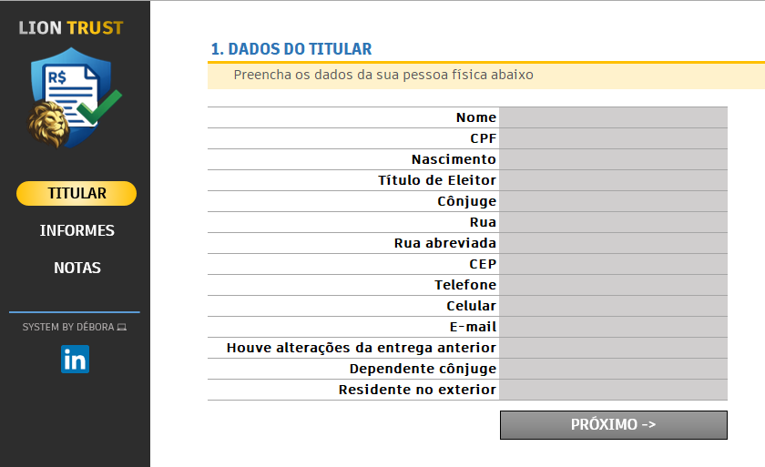
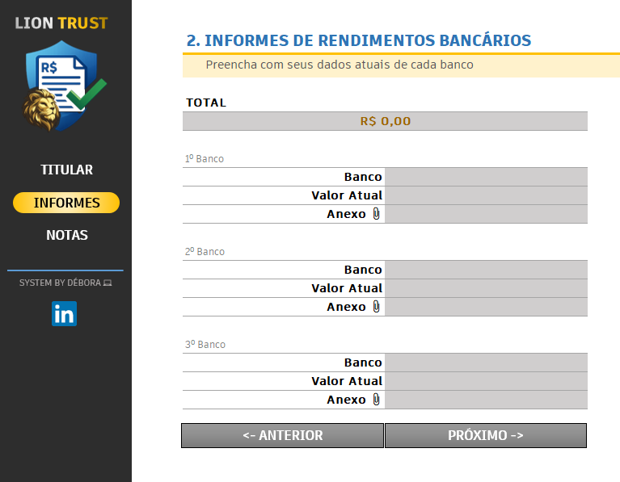
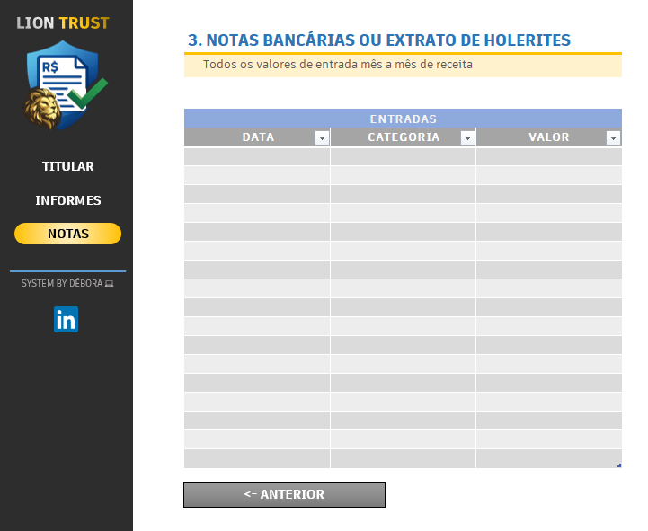

# 📊 Organizador de Declaração de Imposto de Renda (Excel)

## 📌 Descrição do Projeto
Este projeto foi desenvolvido como parte de um **desafio da DIO**, com o objetivo de aplicar, na prática, os conceitos aprendidos sobre organização de dados, validações, usabilidade e documentação técnica.

A solução consiste em um **agregador de dados em Excel** que auxilia no controle e organização das informações necessárias para a **Declaração de Imposto de Renda**, oferecendo uma interface amigável, validações automáticas e estrutura clara para facilitar o preenchimento e a conferência dos dados.

---

## 🎯 Objetivos de Aprendizagem
- Aplicar conceitos estudados em um ambiente prático;
- Estruturar e documentar um projeto técnico de forma clara;
- Utilizar o **GitHub** como ferramenta de versionamento e compartilhamento;
- Criar uma solução funcional no Excel com foco em usabilidade e organização.

---

## 🧠 Funcionalidades do Projeto
- 📁 **Centralização das informações** em um único arquivo;
- ✅ **Validações automáticas de dados** para reduzir erros de preenchimento;
- 🧭 **Menus e organização lógica** para facilitar a navegação;
- 🔗 **Links rápidos** entre abas;
- 📋 Estrutura pensada para atender às principais informações exigidas na declaração.

---

## 🗂️ Estrutura do Arquivo Excel
O arquivo é composto pelas seguintes abas:

- **TÍTULAR**  
  Cadastro dos dados principais do contribuinte.

- **INFORMES**  
  Registro de informes de rendimentos recebidos de diferentes fontes.

- **NOTAS**  
  Controle de despesas, comprovantes e informações complementares.

- **Tabelas**  
  Base de apoio para validações, listas suspensas e padronização dos dados.

---

## 🖼️ Imagens do Projeto

### Aba Titular

### Aba Informes

### Aba Notas

---

## 🚀 Como Utilizar
1. Faça o download do arquivo Excel disponível no repositório;
2. Abra o arquivo no Excel (recomendado Excel Desktop);
3. Preencha os dados conforme cada aba;
4. Utilize as validações e listas suspensas para evitar erros;
5. Use o arquivo como apoio na organização da sua declaração de imposto de renda.

---

## 🛠️ Tecnologias Utilizadas
- **Microsoft Excel**
- Validação de Dados
- Estruturação lógica de informações
- GitHub para versionamento e documentação

---

## 📚 Aprendizados
Este desafio reforçou a importância da **organização de dados**, da **experiência do usuário** e da **documentação técnica** como parte essencial de qualquer solução, mesmo em ferramentas tradicionais como o Excel.

---

## 👩‍💻 Autora
**Débora**  
Estudante em transição para a área de Dados e Business Intelligence, com interesse em organização da informação, análise de dados e soluções práticas para o dia a dia.

---

⭐ Se este projeto te ajudou ou te inspirou, fique à vontade para deixar uma estrela no repositório!
